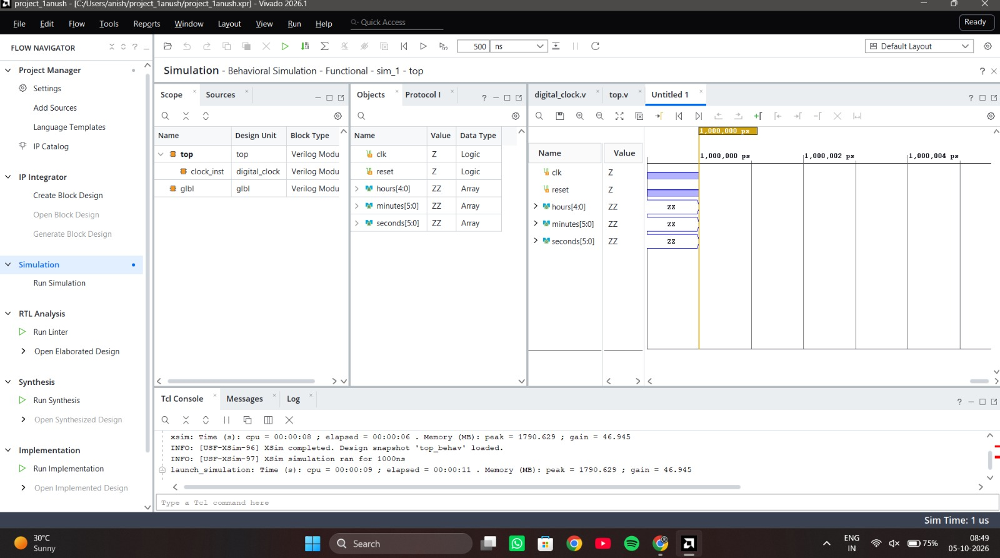

# Digital time display device with multiformat virtual interface configuration

A Verilog/Vivado digital time-display project with a clean, focused repository structure for the submitted design and behavioral simulation.

## Vivado simulation showcase

The following image is the Vivado simulation result provided for this project:



## Team

- **Harish P**
- **Anush K**
- **Abdul Adhil S**

## Features

- HH:MM:SS time representation
- 12/24-hour mode
- 6-digit seven-segment multiplexing
- Numerical hour, minute, and second outputs
- AM/PM output
- Dedicated behavioral simulation testbench

## Repository structure

```
rtl/
└── behavioral_time_display/
    ├── clock_divider.v
    ├── time_counter.v
    ├── seven_segment.v
    ├── time_display.v
    └── top.v

simulation/
└── behavioral/
    └── tb_time_display.v

docs/
├── behavioral_simulation.md
└── team.md

IMG-20261005-WA0006.jpg
```

## Vivado

Use the files in `rtl/behavioral_time_display/` as the design sources and `simulation/behavioral/tb_time_display.v` as the simulation source.

The behavioral implementation uses `DIV_VALUE = 10` for simulation. This is intended for simulation rather than a real 1 Hz FPGA clock divider.

## Toolchain

- Verilog-2001
- Xilinx Vivado
